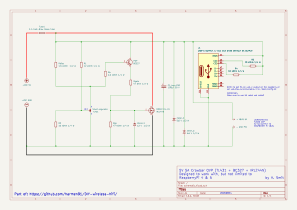

# 5V 5A Crowbar Overvoltage Protection (OVP)
## TL431 + BC327 + IRLZ44N



**Designed for:** Raspberry Pi 4 & 5 (and any other 5 V load)  
**Author:** H. Smit  
**Project:** [DIY Wireless Hi-Fi](https://github.com/harmen91/DIY-wireless-hifi/)

---

## 1. What This Circuit Does

This is a **crowbar overvoltage protection (OVP)** circuit. Its sole purpose is to protect a 5 V load (specifically a Raspberry Pi) from a faulty upstream DC-DC buck converter or other faulty DC power source. It can safely protect your device from input voltages up to 30 V.

In this build, the power chain is:

```
Makita 21 V Battery → Buck Converter (5 V) → Crowbar OVP → Raspberry Pi
```

If the buck converter fails and its output shoots up toward the raw battery voltage (21 V), the crowbar detects the overvoltage, instantly shorts the 5 V rail to ground through a MOSFET, and forces the series fuse to blow — cutting power before the Raspberry Pi is destroyed.

The circuit also provides an **optional USB-C female output** for powering the Raspberry Pi through its USB-C port, with CC pull-ups that advertise a 3 A source capability. Which can now safely be ignored in software by editing `/boot/config.txt` to take full advantage of the 5 A that this board supports. Make sure to use a proper 5 A rated USB cable or directly connect to the VBUS pin with appropriate wire gauge.

---

## 2. How It Works

### 2.1 The Crowbar Principle

A crowbar is a brute-force protection technique. Instead of gracefully regulating or clamping the overvoltage, it **deliberately creates a dead short** across the power rail. This causes the input fuse to blow almost instantly, isolating the load from the fault.

The name comes from the analogy of throwing a crowbar across the power bus.

### 2.2 Circuit Stages

#### Stage 1 — Voltage Sensing (TL431)

The **TL431** is a precision adjustable shunt regulator with a 2.5 V internal reference.

- Resistors **R1 (12 kΩ)** and **R2 (10 kΩ)** form a voltage divider from the 5 V rail to ground.
- The divider tap feeds the **REF** pin of the TL431.
- The trip voltage is calculated as:

```
Vtrip = Vref × (1 + R1 / R2)
Vtrip = 2.5 V × (1 + 12 kΩ / 10 kΩ)
Vtrip = 5.5 V
```

When the rail is at a healthy 5 V, the REF pin sees 2.27 V — below the 2.5 V threshold. The TL431 remains **off** (high impedance between cathode and anode).

When the rail exceeds **5.5 V**, the REF pin crosses 2.5 V and the TL431 turns **on**, pulling its cathode toward ground.

**Rbias (1.5 kΩ)** provides the minimum cathode bias current (~2 mA at 5 V) required for the TL431 to operate correctly.

#### Stage 2 — Driver Amplification (BC327 PNP)

The TL431 can only sink about 100 mA. To drive the gate of a power MOSFET quickly, a **BC327 PNP transistor** is used as a current buffer.

- **Emitter** is tied to the main 5 V rail.
- **Base** is driven through **Rb (2.2 kΩ)**, which limits base current when the TL431 pulls low.
- **Collector** drives the MOSFET gate.

When the TL431 turns on, it pulls the base of the BC327 below the emitter voltage, turning the PNP **on**. The collector then sources current into the MOSFET gate.

#### Stage 3 — Power Switch (IRLZ44N N-Channel MOSFET)

The **IRLZ44N** is a logic-level N-channel MOSFET with very low Rds(on) (~22 mΩ).

- **Drain** is connected to the fused 5 V rail.
- **Source** is connected to ground.
- **Gate** is driven by the BC327 collector through **Rgate (47 Ω)**.

When the BC327 turns on, it charges the MOSFET gate. The IRLZ44N slams fully on, creating a near-short across the 5 V rail. Current skyrockets, and the **5 A fast-blow fuse** opens within milliseconds.

**C1 (100 µF low-ESR, 35 V)** sits directly across the output terminals and absorbs any brief voltage spike during the nanoseconds the MOSFET is still transitioning through its linear region, before it fully shorts the rail.

**Rgs (47 kΩ)** ensures the gate is held at ground when the driver is off, preventing false turn-on from noise or leakage.

**Zener_1 (12 V)** clamps the gate-source voltage to a safe level. During a severe overvoltage event (e.g., 21 V), the BC327 would otherwise try to pull the gate to ~21 V, exceeding the MOSFET's Vgs(max) of ±16 V. The Zener limits Vgs to ~12 V, keeping the MOSFET safe while still fully enhancing it.

#### Stage 4 — Output Protection (Zener_2 & Zener_3)

Two **5.6 V Zener diodes** (Zener_2 and Zener_3) are placed in parallel directly across the output header and USB-C VBUS pins.

These act as a **last-resort voltage clamp** during the brief microsecond gap between "TL431 trips" and "MOSFET fully shorts the rail." If the MOSFET turn-on is momentarily slow, these Zeners conduct and clamp the output to ~5.6 V, preventing any damaging voltage spike from reaching the Raspberry Pi.

They are sacrificial protection — under normal operation they do not conduct. During a healthy crowbar event the MOSFET collapses the rail so fast that they remain dark. They only wake up if something delays the MOSFET.

#### Stage 5 — USB-C Output (Optional)

A **female USB-C receptacle (J1)** provides an alternative to direct GPIO header power.

| Pin | Function | Connection |
|-----|----------|------------|
| VBUS | 5 V power | Direct to fused rail |
| CC1 | Configuration Channel 1 | 10 kΩ pull-up to 5 V (R3) |
| CC2 | Configuration Channel 2 | 10 kΩ pull-up to 5 V (R4) |
| GND | Power return | Ground |
| SHIELD | Connector shell | Ground |
| D+/D−/SBU | Data / Sideband | Unconnected |

The 10 kΩ CC pull-ups tell the Raspberry Pi that this is a **3 A-capable source**. The Pi will boot and draw power normally.

> **Note:** To unlock the Pi 5's full USB peripheral current (up to 1.6 A), add `usb_max_current_enable=1` to `/boot/config.txt`. Without this flag, the Pi limits downstream USB current to ~600 mA because it does not see a full USB-PD 5 A handshake.

> **Important:** Use a **5 A rated USB-C cable** if you intend to draw high current. Standard 3 A cables may overheat.

---

## 3. Component List

| Designator | Component | Value / Rating | Recommended Wattage | Notes |
|------------|-----------|----------------|---------------------|-------|
| F1 | Fuse | 5 A Fast-Blow Glass Tube | — | Must be fast-blow; crowbar relies on rapid opening |
| Rbias | Resistor | 1.5 kΩ | **1/2 W** | Provides TL431 bias current; sees ~19 V during fault |
| R1 | Resistor | 12 kΩ | 1/4 W | Upper divider resistor |
| R2 | Resistor | 10 kΩ | 1/4 W | Lower divider resistor |
| Rb | Resistor | 2.2 kΩ | 1/4 W | Base current limiter for BC327 |
| Rgate | Resistor | **47 Ω** | **1/2 W** | Gate charge current limiter; fast turn-on essential |
| Rgs | Resistor | 47 kΩ | 1/4 W | Gate pull-down; prevents false turn-on |
| R3 | Resistor | 10 kΩ | 1/4 W | CC1 pull-up for USB-C detection |
| R4 | Resistor | 10 kΩ | 1/4 W | CC2 pull-up for USB-C detection |
| R5 | Resistor | 1 kΩ | 1/4 W | Resistor for LED |
| D1 | LED | — | — | Power indicator |
| Zener_1 | Zener Diode | 12 V | **1/2 W** | Clamps MOSFET Vgs to safe level |
| Zener_2 | Zener Diode | 5.6 V | **1/2 W** | Output clamp; catches brief turn-on spike |
| Zener_3 | Zener Diode | 5.6 V | **1/2 W** | Output clamp; parallel with Zener_2 for margin |
| U1 | Shunt Regulator | TL431 | — | Precision 2.5 V reference |
| Q1 | PNP Transistor | BC327 | — | Driver stage; inverts and amplifies TL431 output |
| Q2 | N-Channel MOSFET | IRLZ44N | — | Logic-level; low Rds(on); heatsink recommended |
| C1 | Low-ESR Capacitor | 100 µF 35 V | — | Absorbs brief voltage spike during MOSFET turn-on transient |
| J1 | USB-C Receptacle | Female breakout | — | Optional output for USB-C power input to Pi |
| — | Output Header | 2-pin screw terminal | — | +VBUS 5V / GND for direct GPIO or wire connection |

---

## 4. Simulation Results

The following table shows circuit behavior across the full expected input voltage range, from a deeply discharged battery to a catastrophic buck-converter failure.

| Input Voltage | TL431 REF Voltage | Crowbar State | MOSFET State | Output Voltage | Notes |
|---------------|-------------------|---------------|--------------|----------------|-------|
| **3.0 V** | 1.36 V | OFF | OFF | 3.0 V | Below trip; Pi won't run but no false trigger |
| **4.0 V** | 1.82 V | OFF | OFF | 4.0 V | Below trip; Pi may be unstable |
| **5.0 V** | 2.27 V | OFF | OFF | 5.0 V | **Normal operation**; CC = 1.69 V → Pi sees 3 A source |
| **5.5 V** | 2.50 V | **TRIPS** | ON | → 0 V (fuse blows) | **Exact threshold**; fuse opens in single-digit ms |
| **6.0 V** | 2.73 V | ON | ON | → 0 V (fuse blows) | Zener clamps gate to ~12 V |
| **9.0 V** | 4.09 V | ON | ON | → 0 V (fuse blows) | Rbias ~240 mW, Rgate ~245 mW — within 1/2 W rating |
| **12.0 V** | 5.45 V | ON hard | ON hard | → 0 V (fuse blows) | All fault-mode resistors within rated pulse power |
| **21.0 V** | 9.55 V | ON hard | ON hard | → 0 V (fuse blows) | **Catastrophic buck failure**; fuse blows instantly before Pi is damaged |

### Key Simulation Insights

1. **No false triggers:** The trip point of 5.5 V gives comfortable headroom above the nominal 5 V rail while still protecting the Pi well before its absolute maximum rating (~5.5–6 V for the Pi 5 PMIC).

2. **Fast action:** The BC327 + IRLZ44N combination turns on in microseconds thanks to the 47 Ω Rgate. The fuse is the slowest element, but a fast-blow 5 A fuse opens in under 10 ms under a hard short from a Makita battery.

3. **MOSFET survival:** The 12 V Zener ensures Vgs never exceeds a safe value, even with 21 V on the rail. The IRLZ44N's pulse current rating (~160 A) easily handles the transient short-circuit current.

4. **Output protection:** The dual 5.6 V Zeners across the output catch any residual voltage spike during the nanosecond MOSFET transition. Under normal crowbar operation the MOSFET is fast enough that they do not conduct.

5. **Resistor survival:** Rbias and Rgate are the only components that see significant power during the fault. At 1/2 W each, they have ~2× margin over the calculated ~245 mW fault dissipation.

---

## 5. Usage & Safety Notes

### Before First Power-On
1. **Verify the buck converter output** with a multimeter before connecting this board. It should read 5.0 V ± 0.1 V.
2. **Test the crowbar with the Makita battery only.** Do **not** test with a current-limited lab supply or a buck converter — these sources cannot deliver the 25–50 A needed to blow a fast fuse in milliseconds. The MOSFET will cook in the linear region and the fuse will not blow.
3. **Verify the fuse is fast-blow.** A slow-blow or PTC fuse will allow the MOSFET to overheat in the linear region.

### Raspberry Pi Configuration
If using the USB-C output (J1) with a Raspberry Pi 5, add the following line to `/boot/config.txt`:

```ini
usb_max_current_enable=1
```

This tells the Pi that a high-current supply is present and allows it to deliver up to 1.6 A to downstream USB devices.

### Safe Operating Envelope

| Input Voltage | Reliability |
|---|---|
| **Up to 30 V** | Very high confidence. All components well within pulse ratings. |
| **30–36 V** | Functional, but approaching the TL431 cliff. Margin is thin. |
| **> 36 V** | Crowbar may fail to fire. Do not rely on it. |

### Layout & Wiring Recommendations
- Keep the **crowbar current loop** (Fuse → MOSFET drain → MOSFET source → GND) as short and wide as possible. Use **thick traces or copper pours**.
- Use **14 AWG wire** (minimum 16 AWG) for the battery → fuse → drain → source → GND path. If the wires are thinner than the fuse element, the wires will melt instead of the fuse.
- Place the **fuse** close to the input connector.
- The **MOSFET** should have a heatsink. While the fault event is brief, bench testing or a stuck buck converter could cause sustained dissipation.
- The **12 V gate Zener** should be placed physically close to the MOSFET gate with short leads.
- The **output 5.6 V Zeners** and **C1** should be soldered directly across the output terminals, as close to the header as possible.

### What This Circuit Does NOT Do
- It does **not** regulate voltage.
- It does **not** provide undervoltage protection (a brownout will still crash the Pi).
- It does **not** provide reverse polarity protection.
- It does **not** negotiate USB-PD. The USB-C output is a basic 5 V source only.

---

## 6. What Happens During a Fault

When the buck converter fails and the rail starts climbing past 5.5 V:

1. **TL431 trips** (~1 µs) — REF crosses 2.5 V, cathode pulls low.
2. **BC327 turns on** (~1–5 µs) — PNP sources current into the MOSFET gate.
3. **IRLZ44N slams on** (~5 µs) — Gate charges through 47 Ω, MOSFET enters full conduction.
4. **Rail collapses** (~5–50 µs) — Output voltage drops to ~1–3 V as the MOSFET shorts the rail.
5. **Fuse blows** (~1–3 ms) — The 5 A fast-blow fuse vaporizes under 100+ A from the Makita battery.
6. **Power is cut** — The Pi never sees more than a few microseconds of overvoltage.

The **5.6 V output Zeners** and **C1** are insurance. They catch the nanosecond transition if the MOSFET is momentarily slow. Under healthy operation they do not conduct.

---

## 7. Schematic Summary

```
+21V Battery → Buck (5V) → [Fuse 5A] → [Crowbar OVP] → [USB-C Out / Header Out] → Raspberry Pi
                              │              │
                              │         (TL431 senses >5.5V)
                              │              ↓
                              │         (BC327 drives MOSFET)
                              │              ↓
                              │         (IRLZ44N shorts rail)
                              │              ↓
                              └─── Fuse blows in <10ms ───→ Pi saved
```

---


## 8. Finished PCB


*Part of the [DIY Wireless Hi-Fi](https://github.com/harmen91/DIY-wireless-hifi/) project.*
